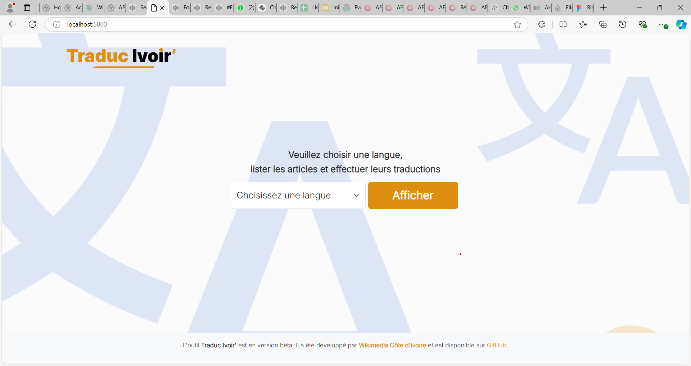

## Traduc Ivoir' (un outil de Wikimedia Côte d'Ivoire)



**Traduc Ivoir'** est un outil en version bêta, développé et géré par l'équipe de développeurs de la communauté [Wikimedia Côte d'Ivoire](https://wikimedia.ci/).  
Il facilite la traduction des articles Wikipédia liés à la Côte d'Ivoire, de l'anglais, de l'allemand, de l'espagnol, de l'arabe et de l'italien vers le français.

## Déployer et tester l'outil Traduc Ivoir' en local

### 1. Préparer l'environnement local

1. Installer [Python 3.x](https://www.python.org/downloads/) (si ce n'est pas déjà fait).
2. Installer le framework [Flask](https://flask.palletsprojects.com/en/latest/) via pip avec la commande suivante :
    ```bash
    $ pip install Flask
    ```

### 2. Cloner le projet

Clonez le projet à partir du dépôt GitHub :
```bash
$ git clone https://github.com/paulbouaffou/traduc-ivoir
```

## Licence

Le projet est open source et disponible sous la [Licence MIT](LICENSE).

